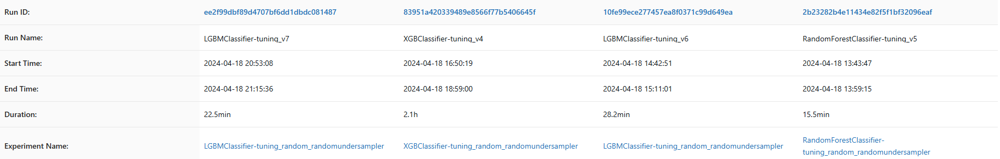
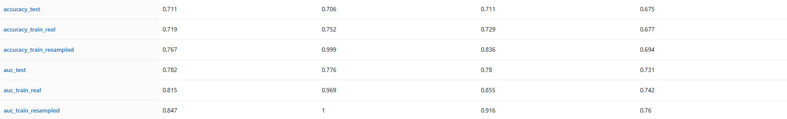
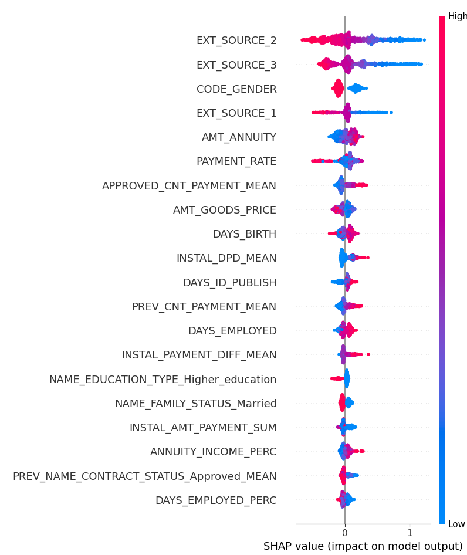

# Projet d'implémentation d'un modèle de scoring
### <i>Projet réalisé dans le cadre de la formation 'Data Scientist' d'Openclassrooms</i>

Liens utiles :   
- Compétition Kaggle à l'origine du projet : <a>https://www.kaggle.com/c/home-credit-default-risk</a>
- Lien vers les données : <a>https://s3-eu-west-1.amazonaws.com/static.oc-static.com/prod/courses/files/Parcours_data_scientist/Projet+-+Impl%C3%A9menter+un+mod%C3%A8le+de+scoring/Projet+Mise+en+prod+-+home-credit-default-risk.zip</a>
- Feature engineering utilisé : <a>https://www.kaggle.com/code/jsaguiar/lightgbm-with-simple-features</a>

***

## Méthodologie d'entraînement du modèle  

#### Objectif et contexte du projet
  L'objectif de ce projet est de créer une api de prédiction pour déterminer l'octroi d'un crédit à la consommation à un client donné.  

  Cette api sera accompagnée d'un dashboard qui permettra de sélectionner le client en question, de requêter l'api et de donner une interprétation du résultat ainsi que visualiser le positionnement du client par rapport aux autres clients.
  Dans ce cadre, nous proposons une méthodologie classique d'entraînement de modèle, avec tracking via mlflow.
  Nous sommes partis d'un feature engineering existant, afin de nous concentrer sur la partie modélisation (voir lien utile n°3)
  
#### Description des données
  Les données sont décrites sur la page du projet kaggle dont est issu le projet (voir lien utile n°1, onglet <i>data</i>) et téléchargeables (voir lien utile n°2). La cible à prédire correspond au défaut de remboursement du crédit (1 : le client a eu des difficultés à rembourser son crédit).

#### Prétraitement des données
  Nous avons conservé le feature engineering existant, mis en place pour un Light GBM Classifier (LGBMC), en ajoutant quelques étapes supplémentaires afin de l'adapter pour qu'il soit testé sur un Random Forest Classier (RFC) et un XGBoost Classifier (XGBC).
  Nous avons notamment inputé les NaN, en prenant soin d'imputer le jeu test à partir du train.
  Les valeurs infinies ont ainsi été transformées en NaN, puis imputées à la médiane.
  Les dernières étapes concernent la séparation en train et test, l'uniformisation des colonnes entre les deux jeux de données et leur sauvegarde dans une base de données.

#### Sélection des modèles
  Après observation du leaderboard de la compétition, nous avons choisi de travailler avec trois types de classifieurs : LGBMC, XGBC et RFC.
  C'est ce choix qui nous a amené à revenir sur le feature engineering afin de l'adapter aux XGBC et RFC qui n'ont pas de système de gestion intégré des valeurs manquantes.

#### Entraînement et validation
##### Validation croisée
  Nous avons choisi d'ajuster le modèle en utilisant une validation croisée bayésienne à 5 plis.   

  Cela permet de concentrer l'exploration des hyperparamètres dans les zones les plus prometteuses et de gagner du temps lors de la recherche par rapport à une simple recherche sur grille (GridSearchCV) ou bien aléatoire (RandomizedSearchCV).
  Malheureusement la librairie BayesSearchCV n'est plus maintenue et son utlisation future est vraisemblablement compromise.

##### Score d'ajustement et seuil d'optimisation du coût métier
  Nous avons opté pour une optimisation du modèle en deux temps : optimisation des hyperparamètres, puis seuillage via la fonction de coût métier.   
  
  Nous avons laissé la fonction de perte par défaut du modèle (log loss pour LGBMC et XGBC, Gini impurity pour RFC) et choisi le score de roc_auc pour la validation croisée.
  Ces choix sont délibérés, car les fonctions de pertes implémentées par défaut sont optimisées pour leurs capacités de convergence.  

#### Tracking
  Nous avons utilisé mlflow via la plateforme dagshub afin d'enregistrer les entraînements des modèles et les différents indicateurs.   

  Nous avons choisi d'enregistrer le seuil optimal et le graphique associé, ainsi que les scores suivants : auc et accuracy sur le jeu train (avec équilibrage et en conditions réelles), auc et accuracy sur le jeu test (conditions réelles), auc de la validation croisée (moyenne sur les plis). Nous avons aussi choisi d'enregistrer un shap explainer entraîné sur le jeu de train équilibré afin de gagner du temps lors du déploiement de l'api de prédiction. Enfin, le seuil, issu du second processus d'optimisation, ainsi que le graphique de recherche d'optimum, ont aussi été enregistrés via mlflow.  

#### Sélection du modèle

  Ayant des performances similaires entre LBGMC et XGBC (RFC en retrait), nous avons choisi un modèle LGBMC pour plusieurs raisons :
  - Modèle plus rapide à entraîner (temps de calcul au moins 2x plus rapide)
  - Modèle plus léger à mettre en place lors du déploiement (librairie moins volumineuse)
  - Modèle permettant plus de flexibilité lors du feature engineering (utile pour des travaux futurs et l'ajout éventuel de nouvelles variables)

***

## Traitement du déséquilibre des classes

#### Description du problème

  Les données utilisées présentent un fort déséquilibre des classes, la classe positive (clients ayant eu des difficultés à rembourser leur crédit) représentant moins de 10% du total de la population.  

#### Traitement appliqué

  Nous avons mis en place un randomundersampler afin de traiter ce déséquilibre. Cela nous permet d'obtenir un jeu équilibré sans créer de fausses données sur la classe à prédire, tout en conservant suffisamment d'information, étant donnée la taille conséquente du jeu initial. Nous avons cependant tenu à calculer les métriques d'accuracy et de roc_auc sur le jeu équilibré et sur le jeu non équilibré, afin de mesurer les performances du modèle en conditions réelles. Par ailleurs, les métriques de test (sauf cas de la validation croisée), sont effectués sur le jeu test non équilibré.

***

## Fonction coût métier 

  Lors de la phase d'optimisation du modèle, une fois le modèle optimisé et les hyperparamètres définis, nous avons implémenté une fonction de coût métier afin de choisir le seuil optimal à appliquer pour la prédiction des classes. Pour cela nous nous commes placés dans une optique de gain et pertes réelles avec des frais de crédit correspondant à 10% du montant du crédit (ce qui revient au ratio demandé de 1 pour 10 entre les faux négatifs et les faux positifs). On obtient les coûts suivants :   
  - Faux négatif : -10 <i>(On prête 10 à un client qui ne va pas rembourser son crédit : on perd tout le crédit prêté, soit 10 unités de coût arbitraires)</i>
  - Vrai négatif : +1 <i>(On prête à un client qui va rembourser son crédit : on gagne les frais du crédit, soit 1 unité de coût arbitraire)</i>   

#### Indicateurs complémentaires

  Nous avons aussi calculé et enregistré les indicateurs suivants pour les différentes valeurs de seuil: précision, rappel, accuracy, fonction fbeta (beta = np.sqrt(5)) et tracé les courbes correspondantes sur le jeu test. Le graphique permet de repérer facilement le seuil optimal.

  

***

## Tableau de synthèse des résultats

Les résultats des différents modèles sont regroupés dans les tableaux suivants :

À résultats similaires, la version 3 du LGBMC est retenue.

***

## Interprétabilité globale et locale du modèle

#### Utilisation de SHAP pour l'interprétabilité du modèle  

  Nous avons décidé d'utiliser la librairie SHAP afin d'interpréter les résultats du modèles à l'échelle globale et locale. L'explainer a été initialiser sur le jeu train équilibré afin d'avoir comme référence, les données sur lesquelles le modèle a été entraîné.

  Les valeurs de SHAP accessibles sur le dashboard pour l'échelle globale ont été calculées à partir d'un échantillon de 2000 individus du jeu train non équilibré. Cette limite de 2000 individus a été mis en place pour éviter un temps de réponse trop long entre le dashboard et l'api (Heroku retournant un timeout à partir d'un délai de 30 secondes et plus).

#### Présentation des résultats

##### Échelle globale

##### Échelle locale

  Pour un crédit accordé :

  Pour un crédit refusé :

***

## Limites et améliorations possibles

#### Intégration du seuil en tant qu'hyperparamètre

  Dans la présente démarche, l'optimisation du modèle se fait en deux temps : hyperparamétrisation, puis seuillage. L'optimisation du seuil est donc indépendante de celle des hyperparamètres du modèle. Cette approche ne garanti donc pas que la combinaison hyperparamètres/seuil trouvée soit la combinaison optimale.  

  Une autre approche serait d'utiliser des librairies spécialisées afin d'optimiser les hyperparamètres et le seuil en même temps. Dans ce cas, il conviendrait de définir la fonction de coût à optimiser et de donner à l'optimiseur les hyperparamètres et le seuil à faire varier. Toutefois, cette approche ne dispenserait pas de

#### Ajout séquentiel des features

  Afin de trouver un modèle optimal minimal, nous pourrions ajouter les features au fur et à mesure et calculer le gain de performance. Cela permettrait de sélectionner seulement les features nécessaires et suffisantes à la capture de la variabilité et d'obtenir un modèle plus synthétique. Cette approche permettrait de diminuer la taille du modèle ainsi que celle du jeu de données nécessaire à sa mise en place. Elle est toutefois plus longue à mettre en place en termes de code.

#### Autres modèles  

  D'autres modèles sont utilisés à des fins de classification sur des données tabulaires. C'est le cas des Deep Neural Netwporks (Multilayer Perceptron) ou encore des TabTransformers. Nous aurions pu essayer ces modèles, mais les coûts en termes de temps de calcul sont plus élevés et demanderaient plus de moyens matériels.

***

## Analyse du Data Drift

#### Création du rapport de drift  

  Afin de produire le rapport de drift, nous avons utilisé la librairie evidently. Nous avons utilisé le jeu application_train comme jeu de référence et application_test comme jeu courant. Nous créé un rapport en utilisant le préréglage DatDriftPreset, afin de détecter la dérive sur les features. Le jeu courant (test) ne contenant pas la cible, nous l'avons écartée du jeu de référence afin d'avoir la même structure de données entre le jeu de référence et le jeu courant. Le rapport généré a été sauvegardé sous format html.

#### Présentation des résultats  

  L'analyse a détecté une dérive pour 7.44% des featurs (9 sur 121). Parmi elles, 4 sont à retenir car elles se retrouvent dans le top 100 de la feature importance intrinsèque du modèle :
  - AMT_ANNUITY : 6ème feature (score de gain = 74, 5ème position avec SHAP)
  - AMT_CREDIT : 13ème feature (score de gain = 53, 13ème position avec SHAP)
  - DAYS_LAST_PHONE_CHANGE : 14ème feature (score de gain = 51, 41ème position avec SHAP)
  - AMT_GOODS_PRICE : 17ème feature (score de gain = 46, 6ème position avec SHAP)

  En regardant de plus près la distribution des données pour les features concernées, on peut voir que le jeu courant ne comporte pas de valeurs extrêmes qui ne seraient pas présentes dans le jeu de référence. Cela limite les inquiétudes quand à l'inexploitabilité éventuelle du jeu test.